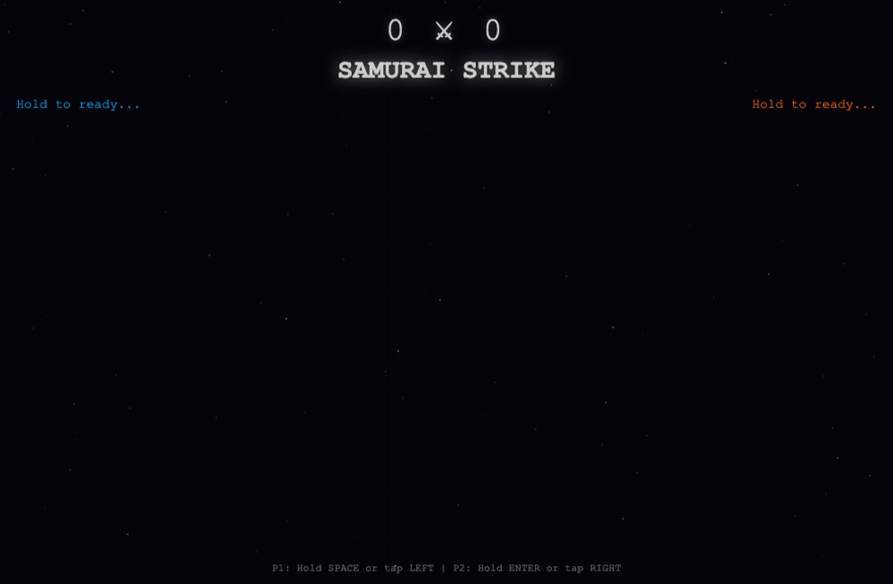

# Iai Samurai Strike ⚔️

**▶ [Play now](https://renrenmimi.github.io/IAI-SAMURAI-STRIKE/)** — runs in your browser, nothing to install.

A two-player duel of nerve. Hold to charge your draw — release too early and you whiff,
hold too long and your blade overheats. One clean strike ends the round.

## How a round goes

1. **Hold to ready** — both samurai start charging
2. **Watch the meter** — `TOO EARLY!` if you release before the window, `OVERHEATED!` if you hold past it
3. **Strike** — the cleaner draw wins the round
4. Miss together and it's `BOTH FAILED!` — reset and go again

## Tech

Single-file HTML5 Canvas app, local two-player. No build step, no dependencies.
